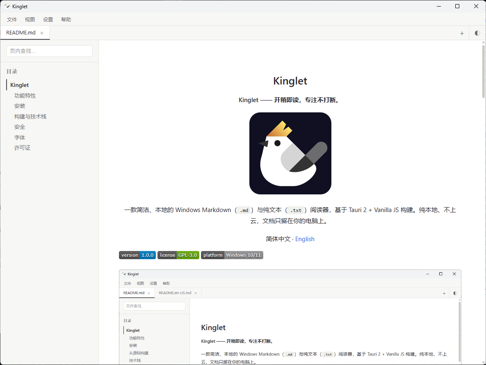
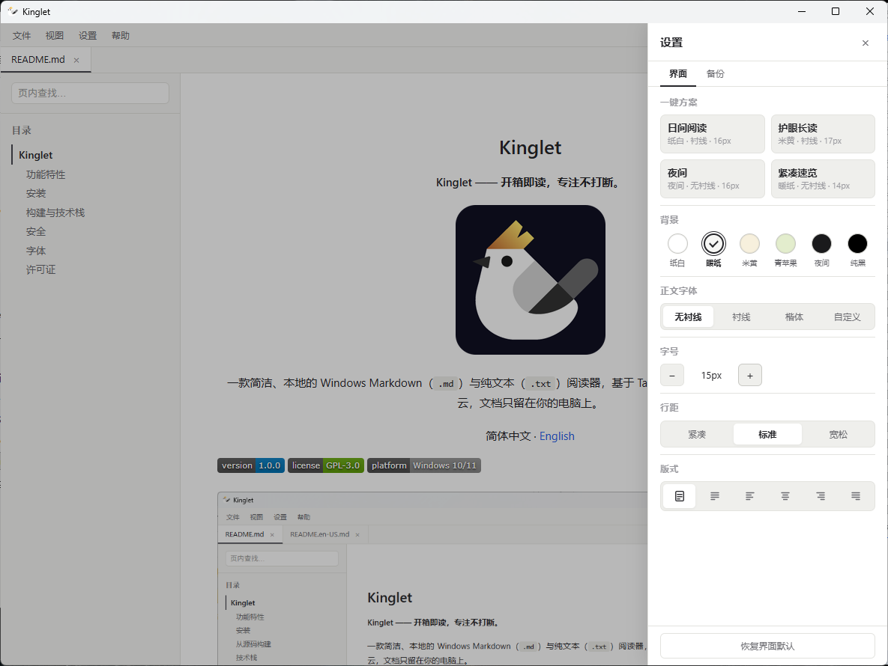

<div align="center">

# Kinglet

**Kinglet —— 开箱即读，专注不打断。**


一款简洁、轻量的 Windows Markdown（`.md`）与纯文本（`.txt`）阅读器，基于 Tauri 2 + Vanilla JS 构建。

简体中文 · [English](README.en-US.md)

</div>






---

## 功能特性

- **轻量** —— 安装包仅约 4 MB
- 打开 `.md` / `.txt`，支持拖拽、多标签
- **每文件独立记忆滚动位置**
- **左侧大纲**，点击跳转 + 滚动高亮
- **页内搜索** `Ctrl+F`
- **代码高亮**
- **KaTeX 数学公式**
- **GFM 表格**、任务列表、脚注、折叠块
- **GBK/GB18030 自动识别**，中文不乱码
- **6 套主题**（白、暖纸、羊皮纸、墨绿、暗色、OLED 纯黑）
- **自定义字体** + 4 档预设
- **字号 / 行距** 可调
- **版式** 5 种对齐
- **右键菜单**
- **打印** 保留格式，无页眉页脚
- **单实例**
- **实时文件监控** —— 外部编辑自动刷新
- **自动更新**
- **本地图片**
- **内链**：`#锚点` 页内跳转；`http(s)` 用浏览器打开；本地 `.md` 新标签打开
- 快捷键：`Ctrl+O` 打开 · `Ctrl+W` 关闭 · `Ctrl+Tab` 下一个 · `Ctrl+P` 打印 · `Ctrl+F` 查找 · `Ctrl+\` 侧栏 · `Ctrl+Shift+L` 主题 · `Ctrl+,` 设置
- 注册为 `.md` / `.markdown` 默认打开程序

---

## 安装

从 [Releases](https://github.com/BExhei/Kinglet/releases) 下载最新 `Kinglet_x.x.x_x64-setup.exe`，双击安装，支持覆盖更新。

> Windows SmartScreen 可能提示（未做代码签名），点「更多信息 → 仍要运行」。

---

## 构建与技术栈

环境要求：Node.js 18+、Rust（msvc）、VS C++ Build Tools。

```bash
git clone https://github.com/BExhei/Kinglet.git
cd kinglet
npm install
npm run tauri:dev        # 开发模式
npm run tauri:build      # 发布构建 → src-tauri/target/release/bundle/nsis/
```

| 层 | 技术 |
|---|---|
| 外壳 | Tauri 2 (Rust) |
| 前端 | Vite + Vanilla JS (ESM) |
| 渲染 | `marked` v17 + `DOMPurify` |
| 代码高亮 | `highlight.js` |
| 数学 | `KaTeX` |
| 插件 | dialog · fs · opener · single-instance · updater |

---

## 安全

- `marked` + `DOMPurify` 净化所有渲染输出的 HTML
- 严格 CSP（`default-src 'self'`）
- 文件访问**动态授权**：仅用户明确打开的文件被授权
- `.txt` 不注册为默认打开程序

---

## 字体

Kinglet 不内嵌字体文件，默认引用系统字体，也可加载本地字体文件。

推荐的自定义免费字体：**思源宋体/黑体**（SIL OFL）、**霞鹜文楷**（SIL OFL）、**JetBrains Mono**（SIL OFL）。

---

## 许可证

[GPL-3.0](LICENSE) © 2026 BExhei
